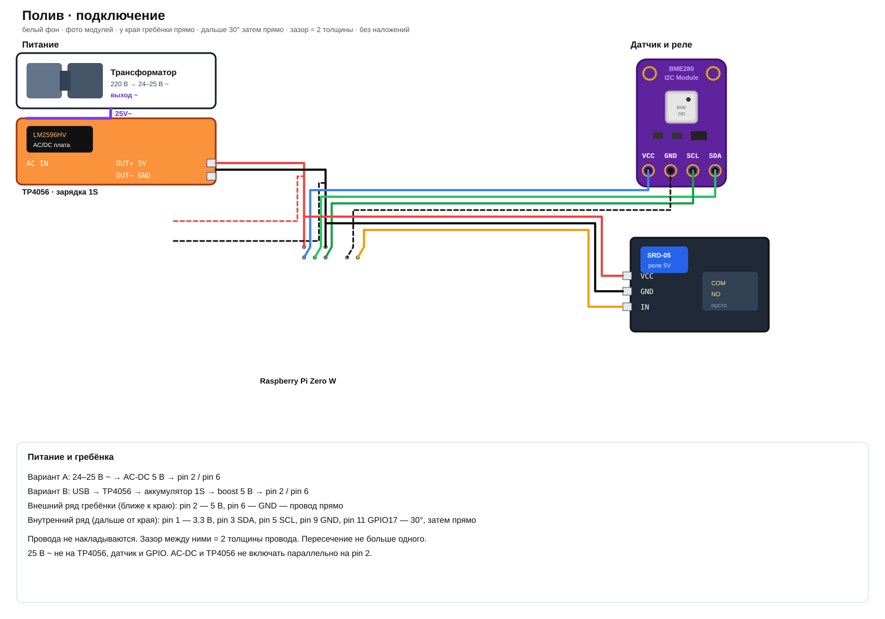

# Irrigation controller (Pi Zero W)

Node + TypeScript. Локально и в Docker железо мокается (`USE_MOCK=true`).

## Список деталей

| # | Деталь | Кол-во | Зачем |
|---|---|---|---|
| 1 | Raspberry Pi Zero W | 1 | контроллер, Wi‑Fi |
| 2 | microSD 16 ГБ+ (Raspberry Pi OS Lite) | 1 | система |
| 3 | BME280, плата 3.3V I2C | 1 | температура, влажность, давление |
| 4 | Реле 5V, 1 канал (лучше с опторазвязкой) | 1 | выход контроллера |
| 5 | Li-ion 18650 или LiPo **1S 3.7V** с защитой | 1 | автономное питание |
| 6 | Держатель 18650 или разъём JST | 1 | посадка аккумулятора |
| 7 | TP4056 **с защитой** (DW01 + FS8205) | 1 | зарядка 1S до 4.2V |
| 8 | USB-кабель к TP4056 + блок 5V 1A | 1 | зарядка от розетки |
| 9 | Boost 3.7→5V (MT3608 / PowerBoost), ≥2A | 1 | питание Pi и катушки реле |
| 10 | Провода Dupont М-Ж, М-М | набор | сигналы и питание логики |
| 11 | Макетная плата / плата с отверстиями | 1 | по желанию |
| 12 | Нагрузка на контакты реле | по месту | не входит в ТЗ; COM/NO свободны |
| 13 | Корпус, стойки, стяжки | по месту | сборка |

### Вариант B — питание от 25V AC

Вместо USB-блока 5V, если уже есть трансформатор 24–25V~. Мост и конденсатор не паять.

| # | Деталь | Кол-во | Зачем |
|---|---|---|---|
| 14 | Трансформатор 24–25 В переменного тока (выход отделён от сети 220 В) | 1 | источник |
| 15 | Готовый модуль **24VAC → 5VDC ≥2A** | 1 | питание Pi и реле |

Нужен **AC-DC**, не LM2596. Вход сразу 24–25V~, выход 5V=.

Искать: `24VAC to 5VDC 2A`, `AC 12V 24V to DC 5V 3A IP67`.

| Модуль | Вход | Выход |
|---|---|---|
| Fulree FAD35J5V2A / 3A | AC 7–35V | 5V 2–3A |
| герметичный IP67 «24vac to 5vdc» | AC 10–26V | 5V 2–3A |
| PowerStream PST-AC24DC5 | AC 8–30V | 5V до 5A |

На корпусе **AC IN 12/24V**, не 85–265V и не «только DC». Hi-Link 5M05 — это 220V, не сюда.

Запасной путь (уже не AC-DC): мост + LM2596HV (в том числе плата Ali с мостом, AC 5–30V).

25 В переменного тока не подключать к TP4056 и к линии 3.3 В. Аккумулятор как резерв: 5 В модуля → USB IN TP4056. Без аккумулятора: 5 В на pin 2.

Не брать: 2S 7.4V на Pi, TP4056 без защиты, модуль слабее 1.5A.

## Подключение



### Питание (Li-ion + зарядка)

Цепочка: **USB 5V → TP4056 → аккумулятор 3.7V 1S → boost 5V → Pi pin 2 / GND**.

| Узел | Куда |
|---|---|
| Li-ion 1S (18650/LiPo, с защитой) | B+ / B− модуля TP4056 |
| TP4056 (лучше с DW01) USB IN | блок 5V для зарядки |
| TP4056 OUT+ / OUT− | VIN+ / VIN− boost |
| Boost 5V VOUT+ | Pin 2 (5V) Zero W и VCC реле |
| Boost 5V VOUT− | GND Pi (pin 6 и 9) |

Пока 5 В идёт на pin 2, USB OTG Zero лучше не подключать. Только один аккумулятор 1S (заряд до 4.2 В). Boost с запасом 1–2 А: Zero W, Wi‑Fi и катушка реле.

### Питание от 25V AC (готовый модуль)

Цепочка: **25V AC → модуль 24VAC→5VDC ≥2A → Pi pin 2 / GND**.

| Узел | Куда |
|---|---|
| Выход трансформатора 24–25 В переменного тока | клеммы **AC / ~ / IN** модуля (полярность не важна) |
| Модуль **5V / +** | Pin 2 и VCC реле; опционально USB IN TP4056 |
| Модуль **GND / −** | GND Pi и GND реле |

Не путать вход переменного тока с выходом 5 В. Мультиметром проверить 5.0–5.2 В на выходе **до** подключения Pi. Провода сети 220 В трансформатора в схему контроллера не выводить. Если в описании модуля нет развязки входа и выхода — плюс и минус 5 В не соединять ни с одним из проводов 25 В переменного тока.

### Датчик и реле

| Устройство | Пин модуля | Pi Zero W |
|---|---|---|
| BME280 | VIN | 3V3 (pin 1) |
| BME280 | GND | GND (pin 6) |
| BME280 | SDA | GPIO2 / pin 3 |
| BME280 | SCL | GPIO3 / pin 5 |
| Реле | VCC | 5V (pin 2 / boost) |
| Реле | GND | GND (pin 9) |
| Реле | IN | GPIO17 / pin 11 (настраивается) |

I2C включить в `raspi-config`. Адрес BME280 обычно `0x76` или `0x77`. В ТЗ только реле: проверяем щелчок, силовую нагрузку не закладываем.

## Сборка

Порядок: сначала питание и логика, нагрузку на COM/NO не подключать, пока реле не щёлкнет с кнопки.

**Инструмент:** отвёртка под клеммы реле, стриппер, мультиметр, термоусадка или изолента.

1. Прошей microSD (Raspberry Pi OS Lite), вставь в Zero W. Пока не подавай 5V на pin 2.
2. На boost мультиметром выставь **5.0–5.2V без нагрузки**, до подключения Pi.
3. Аккумулятор 1S → держатель → **B+ / B−** TP4056. Полярность не перепутать.
4. **OUT+ / OUT−** TP4056 → **VIN+ / VIN−** boost.
5. USB блока 5 В вставить в TP4056, проверить заряд (обычно красный/синий светодиод). Затем USB можно отключить — питание идёт от аккумулятора через boost.
6. Выход boost **5V / GND** → Pi **pin 2 и pin 6**. Кабель в USB Zero в этот момент не вставляй.
7. BME280: VIN→3V3, GND→GND, SDA→pin 3, SCL→pin 5. Питай датчик только с 3.3V, не с 5V.
8. Реле логика: VCC→5V, GND→GND, IN→GPIO17 (pin 11).
9. Включи I2C: `sudo raspi-config` → Interface → I2C. Проверка: `sudo i2cdetect -y 1` — адрес `76` или `77`.
10. Поставь софт, в настройках укажи GPIO реле и адрес BME280, нажми «Полить» — должно щёлкнуть реле.
11. Реле проверено кнопкой «Полить». Внешнюю нагрузку на COM/NO в этом ТЗ не собираем.

**Если питание от 25V AC** (вместо шагов 2–6 с USB):

1. Трансформатор выключен. Выход 24–25 В переменного тока — на вход **AC IN** модуля питания.
2. Без нагрузки измерить выход: **5.0–5.2V**. Если есть подстроечник — выставить.
3. 5V / GND модуля → pin 2 / 6. Либо 5V → USB IN TP4056, если аккумулятор как резерв.
4. Дальше датчик и реле как в шагах 7–11.

25V~ только на вход AC-DC модуля питания, не на катушку реле и не на GPIO. Реле питается 5V с выхода модуля.

Если Pi не стартует — просадка 5V, нужен преобразователь помощнее. Если `i2cdetect` пустой — проверь 3.3V и SDA/SCL. Реле молчит — часто active-low, это уже в настройках.

## Docker (тест / отладка)

```bash
docker compose up --build
```

http://localhost:3000

- `/` — кнопка полива
- `/chart.html` — температура, влажность, точка росы
- `/settings.html` — единицы, тема, Wi‑Fi, IP, NTP, пины

## На самой Pi

```bash
sudo raspi-config   # I2C
npm install
npm i onoff bme280
npx tsc
USE_MOCK=false node dist/index.js
```
