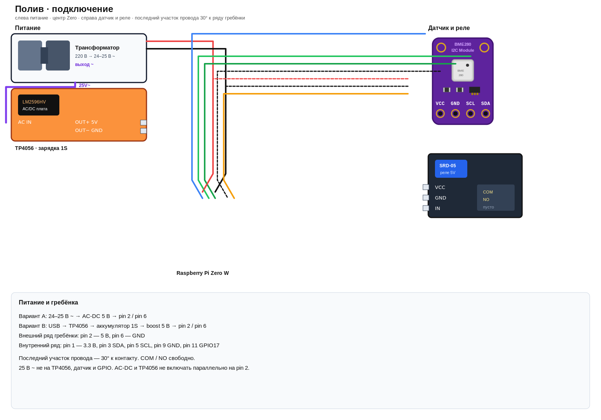
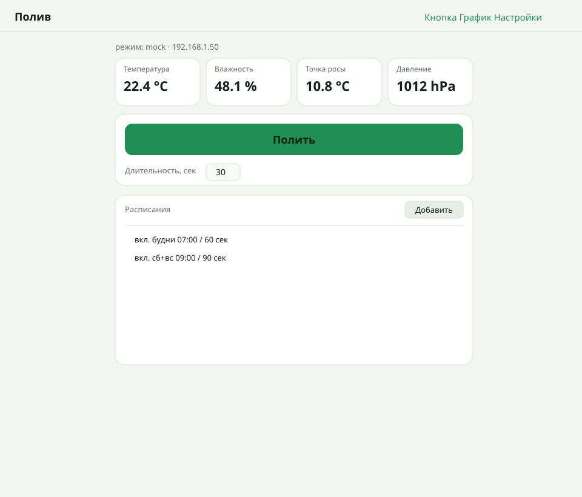
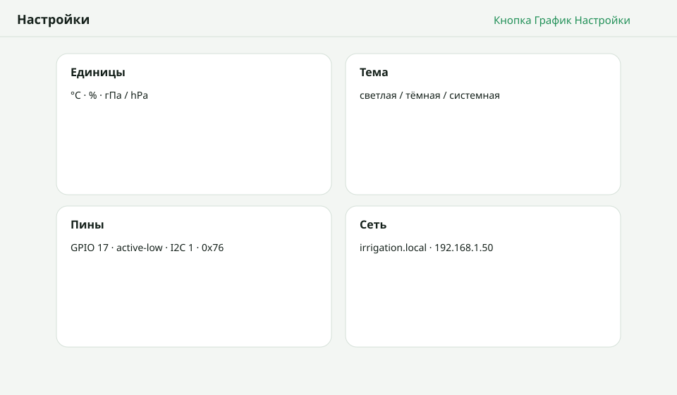
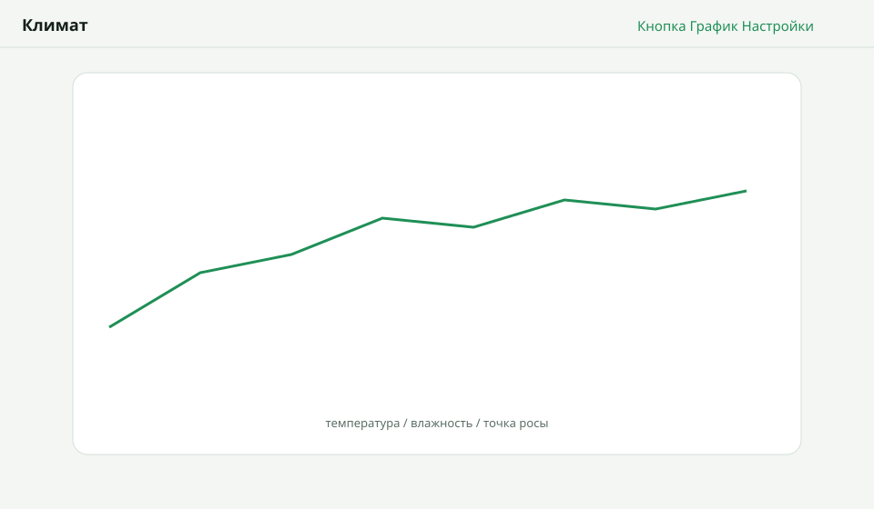

# Irrigation controller (Pi Zero W)

Node + TypeScript. Локально и в Docker железо мокается (`USE_MOCK=true`).

## Список деталей

| # | Деталь | Кол-во | Зачем |
|---|---|---|---|
| 1 | Raspberry Pi Zero W | 1 | контроллер, Wi‑Fi |
| 2 | microSD 16 ГБ+ (Raspberry Pi OS Lite) | 1 | система |
| 3 | BME280, плата 3.3V I2C | 1 | температура, влажность, давление |
| 4 | Реле 5V, 1 канал (лучше с опторазвязкой) | 1 | выход контроллера |
| 5 | Li-ion 18650 или LiPo **1S 3.7V** с защитой | 1 | автономное питание |
| 6 | Держатель 18650 или разъём JST | 1 | посадка аккумулятора |
| 7 | TP4056 **с защитой** (DW01 + FS8205) | 1 | зарядка 1S до 4.2V |
| 8 | USB-кабель к TP4056 + блок 5V 1A | 1 | зарядка от розетки |
| 9 | Boost 3.7→5V (MT3608 / PowerBoost), ≥2A | 1 | питание Pi и катушки реле |
| 10 | Провода Dupont М-Ж, М-М | набор | сигналы и питание логики |
| 11 | Макетная плата / плата с отверстиями | 1 | по желанию |
| 12 | Нагрузка на контакты реле | по месту | не входит в ТЗ; COM/NO свободны |
| 13 | Корпус, стойки, стяжки | по месту | сборка |

### Вариант B — питание от 25V AC

Вместо USB-блока 5V, если уже есть трансформатор 24–25V~. Мост и конденсатор не паять.

| # | Деталь | Кол-во | Зачем |
|---|---|---|---|
| 14 | Трансформатор 24–25 В переменного тока (выход отделён от сети 220 В) | 1 | источник |
| 15 | Готовый модуль **24VAC → 5VDC ≥2A** | 1 | питание Pi и реле |

Нужен **AC-DC**, не LM2596. Вход сразу 24–25V~, выход 5V=.

## Подключение



Исходник: [docs/wiring.svg](docs/wiring.svg).

## Интерфейс

- `/` — кнопка «Полить», длительность вручную, несколько расписаний
- `/chart.html` — температура, влажность, точка росы
- `/settings.html` — единицы, тема, Wi‑Fi, IP, NTP, пины GPIO / I2C

Расписание без cron: дни недели (или «все»), время и длительность. Можно добавить несколько строк (например будни 07:00 и выходные 09:00). Старое поле cron при первом запуске превращается в одно расписание.







## Docker (тест / отладка)

```bash
docker compose up --build
```

http://localhost:3000

## На самой Pi

```bash
sudo raspi-config   # I2C
npm install
npm i onoff bme280
npx tsc
USE_MOCK=false node dist/index.js
```
